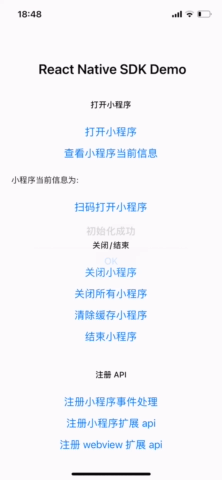

# 深入小程序系列之三、 ReactNative和小程序混编

## 背景

本文我们将开一下脑洞，在 ReactNative 工程基础上下集成及运行小程序方案。

先看一下效果如下:



## 环境搭建

```
npm install -g react-native-cli yarn
```
官方的[环境搭建文档](https://reactnative.dev/docs/environment-setup)已经有详细的说明，这里不再重复。大家可以看下我本地的环境配置版本，目前整个项目运行稳定，可以借鉴。

```bash
$ react-native info
info Fetching system and libraries information...
System:
    OS: macOS 10.15.3
    CPU: (8) x64 Intel(R) Core(TM) i7-4770HQ CPU @ 2.20GHz
    Memory: 93.87 MB / 16.00 GB
    Shell: 3.2.57 - /bin/bash
  Binaries:
    Node: 16.4.0 - ~/.nvm/versions/node/v10.20.1/bin/node
    Yarn: 1.22.4 - ~/.nvm/versions/node/v10.20.1/bin/yarn
    npm: 7.18.1 - ~/.nvm/versions/node/v10.20.1/bin/npm
    Watchman: Not Found
  Managers:
    CocoaPods: 1.10.1 - /usr/local/bin/pod
  SDKs:
    iOS SDK:
      Platforms: iOS 14.4, DriverKit 20.2, macOS 11.1, tvOS 14.3, watchOS 7.2
    Android SDK:
      API Levels: 22, 23, 24, 25, 26, 27, 28, 29, 30
      Build Tools: 23.0.2, 23.0.3, 25.0.0, 26.0.2, 27.0.0, 27.0.3, 28.0.3, 29.0.2, 30.0.2
      System Images: android-28 | Google APIs Intel x86 Atom, android-30 | Google APIs Intel x86 Atom
      Android NDK: 21.3.6528147
  IDEs:
    Android Studio: 4.0 AI-193.6911.18.40.6626763
    Xcode: 12.4/12D4e - /usr/bin/xcodebuild
  Languages:
    Java: 10.0.1 - /Library/Java/JavaVirtualMachines/jdk-10.0.1.jdk/Contents/Home/bin/javac
    Python: 2.7.16 - /usr/bin/python
  npmPackages:
    @react-native-community/cli: Not Found
    react: 17.0.2 => 17.0.2
    react-native: 0.65.1 => 0.65.1
  npmGlobalPackages:
    *react-native*: Not Found

```
## 新建 ReactNative 样例工程


### 新建 ReactNative 工程

```bash

react-native init mopdemo

```

稍等一会...

初始化项目完成之后，你可以选择两种不同的方式运行 App 在 iOS/Android 平台：

注意！ReactNative需要依赖本地安装对应的 iOS,Android 开发工具，即需要安装 Xcode 和 AndroidStudio。具体安装使用方法这里不赘述。

这里我们用 VSCode+Xcode 作为开发组合环境。


### 集成小程序解析引擎

这里我们采用凡泰集成免费社区版的小程序解析引擎，只需要 10 行代码量不到即可完成小程序集成。

1. 引入小程序引擎插件。在 package.json 文件中引入小程序 ReactNative 插件

```javascript
"react-native-mopsdk": "^1.0.2"
```

android 在 build.gradle 添加 maven 配置

```bash
  maven {
      url "https://gradle.finogeeks.club/repository/applet/"
      credentials {
          username "applet"
          password "123321"
      }
  }
```

iOS 需要重新 pod install

2. 在 App.js 文件中增加以下小程序引擎初始化方法。 Mop.instance.initialize 这里需要用到 sdkkey 和 secret。可以直接在[https://mp.finogeeks.com](https://mp.finogeeks.com) 免费注册获取。注册使用方法可以参考 [接入指引](https://mp.finogeeks.com/mop/document/introduce/access/mechanism.html)

```javascript
import MopSDK from 'react-native-mopsdk';
// 1. mop初始化
 MopSDK.initialize(
      {
        appkey: '22LyZEib0gLTQdU3MUauASlb4KFRNRajt4RmY6UDSucA',
        secret: 'c5cc7a8c14a2b04a',
        apiServer: 'https://api.finclip.com',
        apiPrefix: '/api/v1/mop',
      },
      data => {
        console.log('message;', data);
        const s = JSON.stringify(data);
        this.setState({
          status: 'native callback received',
          message: s,
        });
      },
    );
```

3. 打开小程序

```javascript
MopSDK.openApplet('appid','','',(data)=>{});
```


* **SDKKEY** 和 **Secret** 可以从前面部署的社区版的管理后台获取。
* **apiServer** 为这里是小程序生态后端的服务地址也就是前文所输入的`IP:端口`。
* **小程序id** 为在管理后台上架的小程序唯一ID(在小程序小架时自动生成)
* 上述的参数可以在前文服务器部署的后台界面上获取，亦可以在没有部署服务端的情况下在[https://mp.finogeeks.com](https://mp.finogeeks.com)快速注册，免费获取。
* **重要事情说三遍，您可以在官方的github仓库中查看示例代码** [https://github.com/finogeeks/mop-react-native-demo](https://github.com/finogeeks/mop-react-native-demo)
